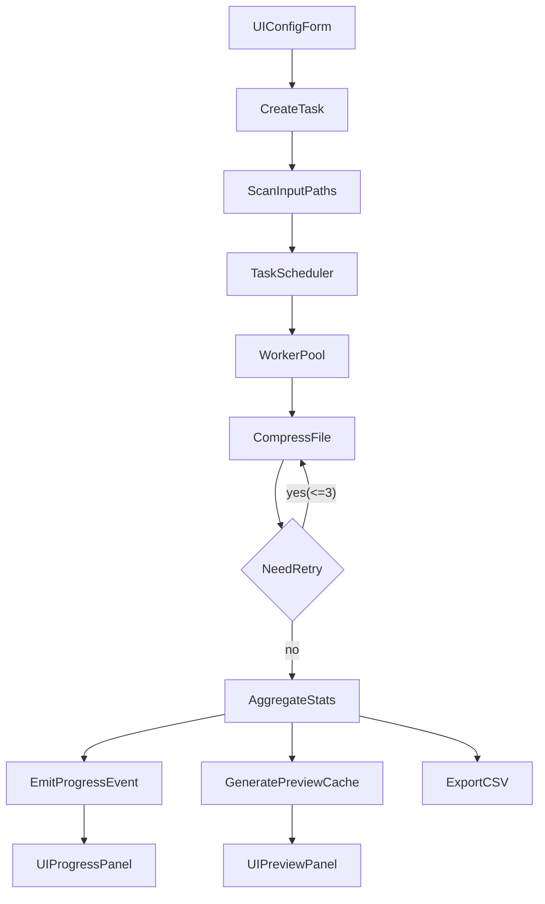

# 智能图片压缩器技术设计说明（TDD）

## 1. 文档信息

- 版本：v1.0
- 对应产品文档：`PRDs/SOFT.md`
- 参考原型：`demo/index.html`、`demo/styles.css`、`demo/app.js`
- 技术栈：Wails + Go + Vue3 + Element Plus
- 适用范围：MVP（不含转 WebP）

## 2. 背景与目标

### 2.1 背景

产品目标是在本地离线环境下，支持用户批量压缩 `jpg/jpeg/png/webp` 图片，并提供清晰的进度、统计和前后预览能力。MVP 已确认决策如下：

1. 默认自动创建输出目录，且允许手动选择输出目录
2. 同名文件默认不覆盖（追加后缀）
3. MVP 不做“转 WebP”，仅保留原格式压缩
4. 默认预设为“高画质（推荐）”
5. 单文件失败自动重试 3 次（指数退避）
6. MVP 需要压缩前后预览对比

### 2.2 目标

1. 提供稳定可扩展的压缩任务架构（支持暂停/继续/取消）
2. 提供统一任务状态机和可观测事件流
3. 提供清晰的 Wails 绑定接口与 DTO 约束
4. 保证性能和质量基线（批量 1000 张稳定运行）

### 2.3 非目标（MVP）

1. 云同步、账号权限
2. 图片编辑（裁剪/滤镜/水印）
3. 视频压缩
4. 断点持久化恢复（仅支持进程内暂停/继续）

## 3. 系统架构设计

### 3.1 总体分层

1. **UI 层（Vue）**：输入输出配置、进度展示、结果页、预览区、明细表
2. **应用服务层（Wails Bindings）**：暴露命令式 API，协调 UI 与后端任务
3. **任务编排层（Go）**：任务状态机、队列、并发 worker、重试策略
4. **图片处理层（Go）**：按格式压缩、质量控制、收益守护
5. **文件系统层（Go）**：扫描输入路径、输出路径映射、写盘与权限处理
6. **统计与报告层（Go）**：聚合结果、导出 CSV、失败明细
7. **预览缓存层（Go）**：生成缩略图与预览读取

### 3.2 模块目录建议

```text
backend/
  internal/
    scanner/
    scheduler/
    compressor/
    retry/
    report/
    preview/
    dto/
    events/
frontend/
  src/
    views/
    components/
    stores/
    services/
    types/
testdata/
  images/
    jpg/
    jpeg/
    png/
    webp/
    mixed/
```

### 3.3 数据流

1. 用户在 UI 配置输入/输出/预设后，调用 `createTask()`
2. 后端扫描文件并建立 `FileJob` 队列
3. `startTask()` 后 scheduler 分发 worker 执行压缩
4. 单文件失败触发 retry（最多 3 次）
5. 每个文件完成后更新聚合统计并触发事件
6. 全部结束后生成结果快照与可选报告
7. 结果页按需请求预览图展示对比



## 4. 核心流程与状态机

### 4.1 任务状态定义

- `PENDING`：任务创建成功，未开始
- `RUNNING`：任务执行中
- `PAUSED`：任务暂停（不再分发新文件）
- `COMPLETED`：任务完成（含部分文件失败但流程结束）
- `FAILED`：任务级不可恢复错误（例如输出目录不可写）
- `CANCELLED`：任务已取消

### 4.2 状态转换规则

1. `PENDING -> RUNNING`：用户点击开始
2. `RUNNING -> PAUSED`：用户点击暂停
3. `PAUSED -> RUNNING`：用户点击继续
4. `RUNNING -> CANCELLED`：用户点击取消
5. `RUNNING -> COMPLETED`：队列消费完成
6. `RUNNING -> FAILED`：任务级关键错误（非单文件错误）

### 4.3 单文件执行流程

1. 读取源文件并识别格式
2. 按预设映射压缩参数
3. 执行压缩编码
4. 应用收益守护（若压后更大，则保留原文件输出并标记 `no_gain`）
5. 写入输出目录
6. 记录文件结果并推送进度事件

## 5. 数据模型与 DTO 设计

### 5.1 Task

```json
{
  "taskId": "string",
  "state": "PENDING|RUNNING|PAUSED|COMPLETED|FAILED|CANCELLED",
  "config": {},
  "createdAt": "RFC3339",
  "startedAt": "RFC3339|null",
  "finishedAt": "RFC3339|null"
}
```

### 5.2 TaskConfig

```json
{
  "inputPaths": ["string"],
  "outputMode": "AUTO|MANUAL",
  "outputDir": "string|null",
  "keepStructure": true,
  "nameConflictPolicy": "RENAME_SUFFIX",
  "preset": "HIGH_QUALITY|BALANCED|HIGH_COMPRESSION",
  "qualityMin": 82,
  "maxWidth": 0,
  "maxHeight": 0,
  "retryTimes": 3,
  "retryBackoffSeconds": [1, 2, 4]
}
```

### 5.3 FileJob

```json
{
  "jobId": "string",
  "taskId": "string",
  "sourcePath": "string",
  "targetPath": "string",
  "format": "jpg|jpeg|png|webp",
  "attempt": 0,
  "maxAttempts": 3,
  "status": "PENDING|RUNNING|SUCCESS|FAILED|SKIPPED_NO_GAIN",
  "errorCode": "string|null",
  "errorMessage": "string|null",
  "bytesBefore": 0,
  "bytesAfter": 0,
  "durationMs": 0
}
```

### 5.4 ProgressSnapshot

```json
{
  "taskId": "string",
  "state": "RUNNING",
  "totalFiles": 100,
  "doneFiles": 72,
  "successFiles": 70,
  "failedFiles": 2,
  "currentFile": "IMG_2381.JPG",
  "currentFileProgressPercent": 45,
  "elapsedSeconds": 3,
  "remainingSeconds": 4,
  "etaSeconds": 86,
  "throughputFilesPerSec": 1.8
}
```

### 5.5 ResultSummary

```json
{
  "totalFiles": 100,
  "successFiles": 97,
  "failedFiles": 3,
  "bytesBefore": 1342177280,
  "bytesAfter": 641728512,
  "bytesSaved": 700448768,
  "savedPercent": 52.3
}
```

## 6. 接口设计（Wails Bindings）

### 6.1 命令接口

1. `selectInputPaths() -> SelectPathsResult`
2. `selectOutputDir() -> SelectDirResult`
3. `createTask(config: TaskConfig) -> CreateTaskResult`
4. `startTask(taskId: string) -> BasicResult`
5. `pauseTask(taskId: string) -> BasicResult`
6. `resumeTask(taskId: string) -> BasicResult`
7. `cancelTask(taskId: string) -> BasicResult`
8. `getTaskSnapshot(taskId: string) -> ProgressSnapshot`
9. `listTaskFiles(taskId: string, page: number, pageSize: number) -> FileJobPage`
10. `openOutputDir(taskId: string) -> BasicResult`
11. `exportReport(taskId: string, format: \"csv\") -> ExportResult`
12. `getPreviewPair(taskId: string, jobId: string) -> PreviewPairResult`

### 6.2 事件接口（推送）

1. `task:state_changed`
2. `task:progress`
3. `task:file_done`
4. `task:error`
5. `task:completed`

### 6.3 接口约束

1. 所有接口统一返回 `code/message/data`
2. 错误对象统一为 `{ errorCode, message, detail }`
3. 进度事件最大发送频率建议 5Hz，避免 UI 频繁重绘

## 7. 压缩策略与质量控制

### 7.1 预设参数建议

1. `HIGH_QUALITY`：JPEG 90, WEBP 88, PNG 压缩级别 4
2. `BALANCED`：JPEG 82, WEBP 80, PNG 压缩级别 6
3. `HIGH_COMPRESSION`：JPEG 75, WEBP 72, PNG 压缩级别 8

### 7.2 收益守护

1. 压缩后体积 `>=` 原体积时，写出“原编码内容”到目标文件
2. `FileJob.status = SKIPPED_NO_GAIN`
3. 统计为“成功但无收益”，纳入成功数

### 7.3 自动重试策略

1. 仅对可重试错误重试（解码偶发失败、写入临时占用）
2. 最大重试次数：3
3. 退避时间：1s -> 2s -> 4s
4. 达到上限后写入失败明细

## 8. 预览对比设计

### 8.1 缓存策略

1. 仅为结果页当前页（或最近 N 张）生成缩略图
2. 缩略图缓存目录：`<task_output>/.preview_cache`
3. 每个预览对尺寸做上限（例如 1920x1080），避免 UI 卡顿

### 8.2 读取策略

1. 前端请求 `getPreviewPair(taskId, jobId)` 按需加载
2. 若预览不可生成，返回占位信息与错误原因
3. 前端显示“该文件暂不支持预览”

## 9. 并发与性能设计

### 9.1 并发模型

1. `workerCount = max(1, cpuCores - 1)`
2. scheduler 从队列取任务分配给 worker
3. `PAUSED` 状态下不再派发新任务，运行中任务自然完成后进入静止

### 9.2 内存与 I/O

1. 目录扫描流式化，避免一次性读取超大文件清单
2. 图片处理采用分文件处理，不保留全量图片对象
3. 输出写入采用原子替换（先临时文件后 rename）

### 9.3 性能指标（MVP 参考）

1. 100 张 4MB JPEG 在 8 核机器 3 分钟内完成（均衡模式）
2. UI 进度刷新稳定，不卡顿

## 10. 错误码与可观测性

### 10.1 错误码建议

1. `E_SCAN_INPUT`：输入路径扫描失败
2. `E_UNSUPPORTED_FORMAT`：不支持格式
3. `E_DECODE`：图片解码失败
4. `E_ENCODE`：图片编码失败
5. `E_WRITE_OUTPUT`：输出写入失败
6. `E_PERMISSION`：权限不足
7. `E_TASK_CANCELLED`：任务取消
8. `E_TASK_STATE`：非法状态转换

### 10.2 日志字段

`timestamp`, `taskId`, `jobId`, `state`, `attempt`, `sourcePath`, `targetPath`, `bytesBefore`, `bytesAfter`, `durationMs`, `errorCode`

### 10.3 监控指标（本地）

1. 任务吞吐（files/sec）
2. 失败率（failed/total）
3. 平均压缩收益（savedPercent）
4. 重试命中率（retried/total）

## 11. 安全与兼容性

1. 全链路本地处理，不上传图片内容
2. 路径处理兼容 Windows/macOS/Linux 分隔符差异
3. 非 ASCII 路径（中文路径）必须可读写
4. 输出目录不可写时，任务创建阶段提前失败并提示

## 12. 测试设计

### 12.1 单元测试

1. 状态机转换
2. 重试次数与退避策略
3. 统计计算（节省比例、ETA）
4. 路径映射与重名策略

### 12.2 集成测试

1. 混合格式目录批处理（jpg/jpeg/png/webp）
2. 自动创建输出目录与手选输出目录
3. 单文件失败重试 3 次后失败记录
4. 暂停/继续/取消流程
5. CSV 报告导出内容正确性

### 12.3 UI 验收（对齐 Demo）

1. 进度区展示总进度、当前文件进度、已运行/剩余时间
2. 结果区展示统计卡片和节省信息
3. 预览区支持上一张/下一张与打开输出目录
4. 底部吸底操作条显示状态文案 + 开始压缩按钮

## 13. Definition of Done（TDD 维度）

1. 核心接口、状态机、数据模型、错误码均已定义
2. 与 PRD 决策一致，无冲突项
3. 与 Demo 交互骨架映射清晰
4. 可直接用于开发任务拆解与实施

## 14. 技术补充（开源依赖与实现建议）

> 本节按你的要求补充：压缩库使用 `github.com/disintegration/imaging v1.6.2`，HTTP 使用 `github.com/gin-gonic/gin`，并优先采用成熟开源包。以下建议已通过 Context7 检索对应官方文档要点。

### 14.1 依赖清单（建议）

1. 图片压缩与处理（必选）  
   - `github.com/disintegration/imaging v1.6.2`  
   - 用途：图片读写、Resize/Fit、JPEG/PNG/WebP 编码输出、缩略图生成

2. HTTP 服务（必选）  
   - `github.com/gin-gonic/gin`  
   - 用途：本地 API（健康检查、调试接口、任务查询接口）、路由分组、中间件、JSON 返回

3. 任务并发与队列（优先开源）  
   - 推荐：`github.com/alitto/pond/v2`  
   - 用途：worker pool、有界队列、上下文取消、任务组等待  
   - 说明：比手写 goroutine + channel 更易维护，便于控制最大并发与任务堆积

4. 重试策略（优先开源）  
   - 推荐：`github.com/cenkalti/backoff/v4`  
   - 用途：指数退避重试（对齐 1s/2s/4s 策略）

5. 结构化日志（优先开源）  
   - 推荐：`go.uber.org/zap`  
   - 用途：结构化日志、性能较优、方便追踪 taskId/jobId

6. 配置管理（优先开源）  
   - 推荐：`github.com/spf13/viper`  
   - 用途：加载开发/生产配置（并发数、日志级别、默认输出策略）

### 14.2 `imaging v1.6.2` 落点设计

1. 在 `backend/internal/compressor` 中统一封装 `imaging`，上层只依赖内部接口，不直接依赖三方库。
2. 使用 `Resize/Fit` + 高质量采样（如 `Lanczos`）处理缩放场景。
3. 使用 `imaging.Save` 结合格式参数落盘，输出保持原格式（MVP 不转 WebP）。
4. 预览缩略图由 `backend/internal/preview` 调用 `imaging` 生成，避免全尺寸图直接渲染。

### 14.3 `gin` 落点设计

1. 在 `backend/internal/httpapi` 提供本地可选调试服务（默认可关闭，避免影响纯桌面模式）。
2. 路由按分组设计：  
   - `/api/v1/tasks`（查询任务、快照、明细）  
   - `/api/v1/system`（健康检查、版本信息）
3. 中间件建议：请求日志、panic recovery、请求 ID。
4. 支持优雅关闭（graceful shutdown），避免应用退出时中断正在处理的请求。

### 14.4 队列与并发实现建议（使用开源包）

1. 使用 `pond` 创建固定 worker 数池：`max(1, cpu-1)`。
2. 使用有界队列（`WithQueueSize`）防止任务无限堆积。
3. 任务控制（暂停/取消）通过 `context` 传播到任务组（`NewGroupContext`）。
4. 任务结束使用 `StopAndWait` 或 group `Wait` 保证状态一致。

### 14.5 依赖策略与版本治理

1. 三方依赖优先选择活跃、文档完整、社区成熟的开源包。
2. 版本策略：MVP 固定版本（尤其是 `imaging v1.6.2`），避免隐式升级导致行为漂移。
3. 升级策略：每个小版本升级需通过回归样本（jpg/jpeg/png/webp）与三端冒烟测试。
4. 回退策略：关键依赖升级前记录 `go.mod` 基线，升级异常时可快速回滚。

### 14.6 对现有章节的约束补充

1. 第 6 章接口设计保持不变；若引入 `gin`，其职责为“可选本地 HTTP 面”，不替代 Wails bindings。
2. 第 8/9 章并发与性能建议优先采用 `pond` 方案。
3. 第 10 章错误与日志建议按 `zap` 结构化字段输出，便于后续排障。
